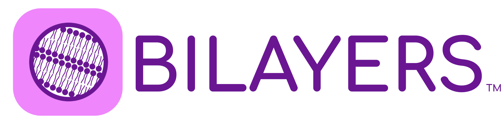

## BiLayers 

[bilayers overview](./assets/bilayers.png)

## Summary

The past 10 years have seen an explosion of algorithms, especially deep learning algorithms, to overcome specific challenges in bioimage analysis. Unfortunately, the vast majority of biologists are not comfortable using the terminal or working with command line tools, and thus cannot utilize these deep learning tools. While user friendly tools such as DeepImageJ, ZeroCostDL4Mic, BiaPy and CellProfiler can assist with making these algorithms more user friendly, there is, to our knowledge, no standard for describing the input and output structures for a given image analysis algorithm, and many of these tools require extremely complex post-processing beyond the algorithm stored in places like the Bioimage Model Zoo. Due to the lack of a convenient user interface, many helpful tools never reach the end user who would benefit from them most. We have therefore launched Bilayers, a specification designed to characterize software containers in terms of expected inputs, outputs, and tunable parameters. Any container described in a Bilayers configuration file can use the Bilayers Continuous Integration/Continuous Deployment (CI/CD) platform to programmatically generate versions with user-friendly, no-terminal-required interfaces. The platform currently supports Gradio and Jupyter, with plans to expand to other user interfaces, including CellProfiler plugins. Since end-users are using a container which can also be deployed to an HPC or to the cloud, there is no danger of version drift between the prototype used by a biologist and the large-scale workflow run at scale. We believe such a specification will also aid sysadmins design and validate workflows created for end users in tools such as Nextflow or Snakemake. We will demonstrate existing use cases, as well as our configuration specification, with hopes for community feedback and contributions.

### What we hope bilayers will be:
- An extensible spec based on LinkML that is valuable to the community, that covers the vast majority of common image analysis tool inputs, outputs, and parameters
- A listing of submitted image analysis container descriptions, described according to the spec
- A CI/CD which _attempts_ to build some set of user interfaces for each submitted container (Gradio, Jupyter, CellProfiler plugin, Fiji plugin, text translation from bilayers-spec to Galaxy-spec, etc; right now, Gradio and Jupyter are what we have built so far); these will range in user-friendliness from "very" to "very not"
- A set of containers built with that CI/CD in a container hub (right now, Dockerhub); possibly other artifacts in other locations for non-container interfaces (such as a CellProfiler plugin draft or a draft Galaxy-spec)

### What we ourselves are not planning bilayers to be:
- A fully complete spec that covers every possible use case (but we are happy to support and link to others' extensions)
- Containerization of any and all image analysis tools the community creates - we hope the automated creation of interfaces and bridges incentivizes people to containerize their own tools and we are often happy to provide advice, but there's just too much out there for us to do it ourselves
- Interfaces or wrappers to every other tool out there - though we're happy to work with folks who are more expert in things we are familiar with but not world experts (Galaxy, Nextflow, QuPath, etc) if they want to help put interface template scripts together
- A dense grid of "all tools x all interfaces" (some things just won't be compatible, and we unfortunately cannot put time into any individual tool x interface combo - it's just too much a time sink)
- Anything whatsoever on how to connect these tools - think the master lego brick catalog, not individual kits or kit manuals. (Aka, we're not trying to recreate nextflow, or snakemake, or cwl/wdl)

## That sounds cool! How can I participate?

Please feel free to create [issues](https://github.com/bilayer-containers/bilayers/issues) or participate in [discussions](https://github.com/orgs/bilayer-containers/discussions); you may find especially useful the [running lists of tools we plan to wrap and wrappers we plan to make](https://github.com/orgs/bilayer-containers/discussions/categories/running-lists-of-things) especially good places to start. You can also reach out to Beth Cimini  at bcimini [AT] broadinstitute [DOT] org.
