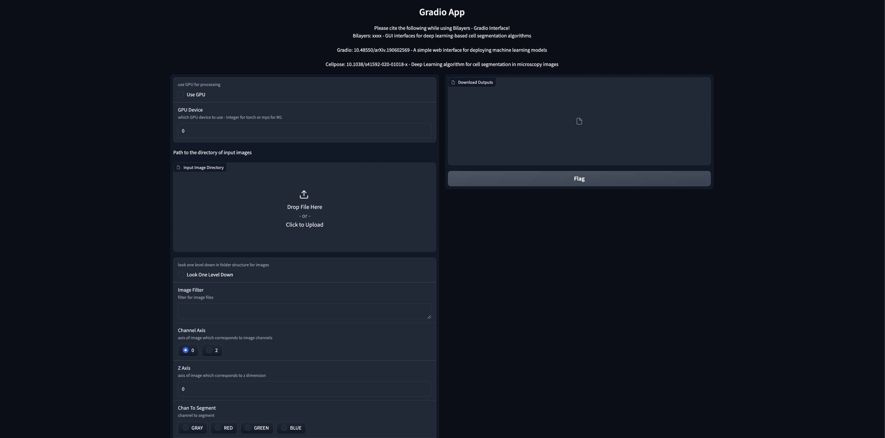
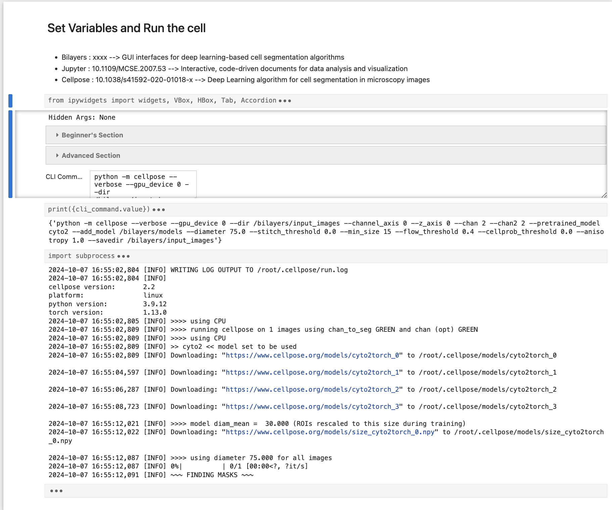

## What is Gradio?

Gradio provides a quick and easy way to demo your machine learning model through a user-friendly web interface, making it accessible to anyone, anywhere. [Learn More](https://www.gradio.app/)

---

## What is a Jupyter Notebook?

Jupyter Notebooks offer a flexible, interactive environment where users can run and modify code. [Learn More](https://jupyter-notebook.readthedocs.io/en/latest/)

