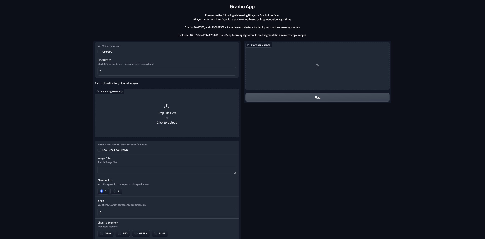
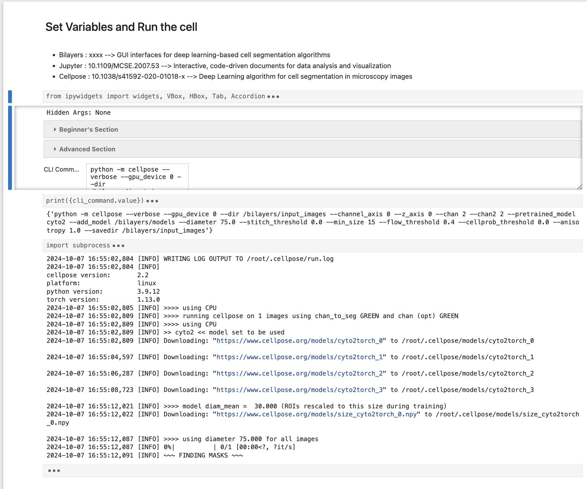

Bilayers supports four interface types for interacting with image-analysis algorithms:

1. **Gradio** – A no-code web-based UI
2. **Jupyter Notebook** – An interactive coding environment
3. **Streamlit** – A scriptable web-based UI tuned for richer custom layouts
4. **CellProfiler plugin** – A Python plugin runnable from within CellProfiler

The first three produce a containerized web/notebook app on DockerHub. The CellProfiler plugin produces a `.py` file that drops directly into a CellProfiler installation — it intentionally does not produce its own container.

## Gradio : Instant Web-Based Interface

**Best for:** Users who want a simple, interactive web-based UI without coding.

Gradio provides a quick and easy way to demo your machine learning model through a user-friendly web interface, making it accessible to anyone, anywhere. [Learn More](https://www.gradio.app/)

---

## Jupyter Notebook

Jupyter Notebooks offer a flexible, interactive environment where users can run and modify code. [Learn More](https://jupyter-notebook.readthedocs.io/en/latest/)

---

## Streamlit

**Best for:** Users who want a scriptable web UI with richer custom layouts than Gradio provides.

Streamlit lets you compose data apps from ordinary Python, with native widgets for uploads, sliders, and result displays. Bilayers' Streamlit generator wires your algorithm's `cli_tag`s straight into the rendered widgets and emits a `streamlit_app.py` you can run with `streamlit run streamlit_app.py`. [Learn More](https://streamlit.io/)

---

## CellProfiler plugin

**Best for:** Users who already run CellProfiler pipelines and want your algorithm to appear as a module they can drop into a pipeline.

The CellProfiler-plugin generator picks a CellProfiler module category from your config's input/output types (e.g. `image → object` becomes "Image Segmentation", `image → measurement` becomes "Measurement") and emits a `run<YourAlgorithm>.py` file. Place that file in your CellProfiler plugins directory and the module shows up in the pipeline editor on the next restart. [Learn More about CellProfiler plugins](https://plugins.cellprofiler.org/).

Note: unlike Gradio / Jupyter / Streamlit, this interface does not produce a Docker image of its own — it produces a Python plugin file that runs against an existing CellProfiler install.