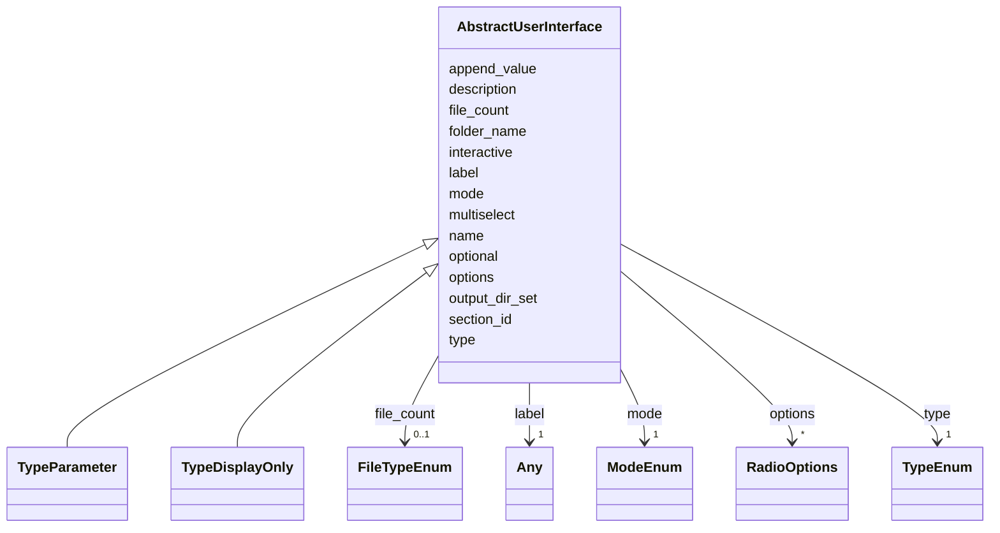

# Class: AbstractUserInterface


_Abstract class for user interface_


* __NOTE__: this is an abstract class and should not be instantiated directly


URI: [https://w3id.org/my-org/validate_schema/:AbstractUserInterface](https://w3id.org/my-org/validate_schema/:AbstractUserInterface)





## Inheritance
* **AbstractUserInterface**
    * [TypeParameter](TypeParameter.md)
    * [TypeDisplayOnly](TypeDisplayOnly.md)


## Slots

| Name | Cardinality and Range | Description | Inheritance |
| ---  | --- | --- | --- |
| [name](name.md) | 1 <br/> [String](String.md) | Name of the docker_image, algorithm, parameter, display_only | direct |
| [type](type.md) | 1 <br/> [TypeEnum](TypeEnum.md) | Type of the inputs, parameters and outputs | direct |
| [label](label.md) | 1 <br/> [Any](Any.md) | Label of the object, but also Radio button's label | direct |
| [description](description.md) | 0..1 <br/> [String](String.md) | Description of the Algorithm | direct |
| [optional](optional.md) | 1 <br/> [Boolean](Boolean.md) | Optional value of the object | direct |
| [section_id](section_id.md) | 1 <br/> [String](String.md) | Section ID of the object | direct |
| [mode](mode.md) | 1 <br/> [ModeEnum](ModeEnum.md) | Mode of the object | direct |
| [output_dir_set](output_dir_set.md) | 0..1 <br/> [Boolean](Boolean.md) | Output directory set | direct |
| [folder_name](folder_name.md) | 0..1 <br/> [String](String.md) | Folder name of the object | direct |
| [file_count](file_count.md) | 0..1 <br/> [FileTypeEnum](FileTypeEnum.md) | Type of Number of files | direct |
| [options](options.md) | * <br/> [RadioOptions](RadioOptions.md) | Options of the Radio button in parameters, display_only | direct |
| [interactive](interactive.md) | 0..1 <br/> [Boolean](Boolean.md) | Whether the object is interactive on UI | direct |
| [append_value](append_value.md) | 0..1 <br/> [Boolean](Boolean.md) | Append value of the hidden argument | direct |
| [multiselect](multiselect.md) | 0..1 <br/> [Boolean](Boolean.md) | Multiselect value of the dropdown | direct |


## Aliases


* parameters
* display_only


## Identifier and Mapping Information


### Schema Source


* from schema: https://w3id.org/my-org/validate_schema


## Mappings

| Mapping Type | Mapped Value |
| ---  | ---  |
| self | https://w3id.org/my-org/validate_schema/:AbstractUserInterface |
| native | https://w3id.org/my-org/validate_schema/:AbstractUserInterface |


## LinkML Source

<!-- TODO: investigate https://stackoverflow.com/questions/37606292/how-to-create-tabbed-code-blocks-in-mkdocs-or-sphinx -->

### Direct

<details>
```yaml
name: AbstractUserInterface
description: Abstract class for user interface
from_schema: https://w3id.org/my-org/validate_schema
aliases:
- parameters
- display_only
abstract: true
slots:
- name
- type
- label
- description
- optional
- section_id
- mode
- output_dir_set
- folder_name
- file_count
- options
- interactive
- append_value
- multiselect
rules:
- preconditions:
    slot_conditions:
      type:
        name: type
        equals_string: checkbox
  postconditions:
    slot_conditions:
      append_value:
        name: append_value
        required: true
  description: Extra flags needed iff type is checkbox
- preconditions:
    slot_conditions:
      type:
        name: type
        equals_string: files
  postconditions:
    slot_conditions:
      file_count:
        name: file_count
        required: true
  description: Extra flags needed iff type is files
- preconditions:
    slot_conditions:
      type:
        name: type
        equals_string: radio
  postconditions:
    slot_conditions:
      options:
        name: options
        required: true
  description: Extra flags needed iff type is radio
- preconditions:
    slot_conditions:
      type:
        name: type
        equals_string: dropdown
  postconditions:
    slot_conditions:
      options:
        name: options
        required: true
      multiselect:
        name: multiselect
        required: true
  description: Extra flags needed iff type is dropdown

```
</details>

### Induced

<details>
```yaml
name: AbstractUserInterface
description: Abstract class for user interface
from_schema: https://w3id.org/my-org/validate_schema
aliases:
- parameters
- display_only
abstract: true
attributes:
  name:
    name: name
    description: Name of the docker_image, algorithm, parameter, display_only
    from_schema: https://w3id.org/my-org/validate_schema
    rank: 1000
    alias: name
    owner: AbstractUserInterface
    domain_of:
    - AbstractWorkflowDetails
    - AbstractUserInterface
    - ExecFunction
    - DockerImage
    - TypeAlgorithmFromCitation
    range: string
    required: true
  type:
    name: type
    description: Type of the inputs, parameters and outputs
    from_schema: https://w3id.org/my-org/validate_schema
    rank: 1000
    alias: type
    owner: AbstractUserInterface
    domain_of:
    - AbstractWorkflowDetails
    - AbstractUserInterface
    range: TypeEnum
    required: true
  label:
    name: label
    description: Label of the object, but also Radio button's label
    from_schema: https://w3id.org/my-org/validate_schema
    rank: 1000
    alias: label
    owner: AbstractUserInterface
    domain_of:
    - AbstractWorkflowDetails
    - AbstractUserInterface
    - RadioOptions
    range: Any
    required: true
  description:
    name: description
    description: Description of the Algorithm
    from_schema: https://w3id.org/my-org/validate_schema
    rank: 1000
    alias: description
    owner: AbstractUserInterface
    domain_of:
    - AbstractWorkflowDetails
    - AbstractUserInterface
    - TypeAlgorithmFromCitation
    range: string
  optional:
    name: optional
    description: Optional value of the object
    from_schema: https://w3id.org/my-org/validate_schema
    rank: 1000
    alias: optional
    owner: AbstractUserInterface
    domain_of:
    - AbstractWorkflowDetails
    - AbstractUserInterface
    range: boolean
    required: true
  section_id:
    name: section_id
    description: Section ID of the object
    from_schema: https://w3id.org/my-org/validate_schema
    rank: 1000
    alias: section_id
    owner: AbstractUserInterface
    domain_of:
    - AbstractWorkflowDetails
    - AbstractUserInterface
    range: string
    required: true
  mode:
    name: mode
    description: Mode of the object
    from_schema: https://w3id.org/my-org/validate_schema
    rank: 1000
    alias: mode
    owner: AbstractUserInterface
    domain_of:
    - AbstractWorkflowDetails
    - AbstractUserInterface
    range: ModeEnum
    required: true
  output_dir_set:
    name: output_dir_set
    description: Output directory set
    from_schema: https://w3id.org/my-org/validate_schema
    rank: 1000
    alias: output_dir_set
    owner: AbstractUserInterface
    domain_of:
    - AbstractUserInterface
    range: boolean
    required: false
  folder_name:
    name: folder_name
    description: Folder name of the object
    from_schema: https://w3id.org/my-org/validate_schema
    rank: 1000
    alias: folder_name
    owner: AbstractUserInterface
    domain_of:
    - AbstractWorkflowDetails
    - AbstractUserInterface
    range: string
    required: false
  file_count:
    name: file_count
    description: Type of Number of files
    from_schema: https://w3id.org/my-org/validate_schema
    rank: 1000
    alias: file_count
    owner: AbstractUserInterface
    domain_of:
    - AbstractWorkflowDetails
    - AbstractUserInterface
    range: FileTypeEnum
    required: false
  options:
    name: options
    description: Options of the Radio button in parameters, display_only
    from_schema: https://w3id.org/my-org/validate_schema
    rank: 1000
    alias: options
    owner: AbstractUserInterface
    domain_of:
    - AbstractUserInterface
    range: RadioOptions
    required: false
    multivalued: true
  interactive:
    name: interactive
    description: Whether the object is interactive on UI
    from_schema: https://w3id.org/my-org/validate_schema
    rank: 1000
    alias: interactive
    owner: AbstractUserInterface
    domain_of:
    - AbstractUserInterface
    range: boolean
    required: false
  append_value:
    name: append_value
    description: Append value of the hidden argument
    from_schema: https://w3id.org/my-org/validate_schema
    rank: 1000
    alias: append_value
    owner: AbstractUserInterface
    domain_of:
    - AbstractUserInterface
    - HiddenArgs
    range: boolean
    required: false
  multiselect:
    name: multiselect
    description: Multiselect value of the dropdown
    from_schema: https://w3id.org/my-org/validate_schema
    rank: 1000
    alias: multiselect
    owner: AbstractUserInterface
    domain_of:
    - AbstractUserInterface
    range: boolean
    required: false
rules:
- preconditions:
    slot_conditions:
      type:
        name: type
        equals_string: checkbox
  postconditions:
    slot_conditions:
      append_value:
        name: append_value
        required: true
  description: Extra flags needed iff type is checkbox
- preconditions:
    slot_conditions:
      type:
        name: type
        equals_string: files
  postconditions:
    slot_conditions:
      file_count:
        name: file_count
        required: true
  description: Extra flags needed iff type is files
- preconditions:
    slot_conditions:
      type:
        name: type
        equals_string: radio
  postconditions:
    slot_conditions:
      options:
        name: options
        required: true
  description: Extra flags needed iff type is radio
- preconditions:
    slot_conditions:
      type:
        name: type
        equals_string: dropdown
  postconditions:
    slot_conditions:
      options:
        name: options
        required: true
      multiselect:
        name: multiselect
        required: true
  description: Extra flags needed iff type is dropdown

```
</details>