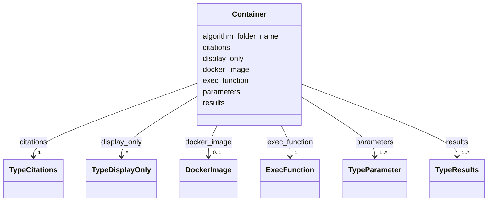

# Class: Container


_Container class which holds all the high_level keywords from config.yaml file of specific algorithm_


URI: [https://w3id.org/my-org/validate_schema/:Container](https://w3id.org/my-org/validate_schema/:Container)





<!-- no inheritance hierarchy -->


## Slots

| Name | Cardinality and Range | Description | Inheritance |
| ---  | --- | --- | --- |
| [parameters](parameters.md) | 1..* <br/> [TypeParameter](TypeParameter.md) | Parameters of a specific Algorithm | direct |
| [display_only](display_only.md) | * <br/> [TypeDisplayOnly](TypeDisplayOnly.md) | Display only parameters of a specific Algorithm | direct |
| [results](results.md) | 1..* <br/> [TypeResults](TypeResults.md) | Results of a specific Algorithm | direct |
| [exec_function](exec_function.md) | 1 <br/> [ExecFunction](ExecFunction.md) | Function to execute the Algorithm | direct |
| [docker_image](docker_image.md) | 0..1 <br/> [DockerImage](DockerImage.md) | Description of docker_image for the specific algorithm | direct |
| [algorithm_folder_name](algorithm_folder_name.md) | 0..1 <br/> [String](String.md) | Main folder name of the algorithm to put the generated files in the folder | direct |
| [citations](citations.md) | 1 <br/> [TypeCitations](TypeCitations.md) | Citations of the Algorithm | direct |


## Identifier and Mapping Information


### Schema Source


* from schema: https://w3id.org/my-org/validate_schema


## Mappings

| Mapping Type | Mapped Value |
| ---  | ---  |
| self | https://w3id.org/my-org/validate_schema/:Container |
| native | https://w3id.org/my-org/validate_schema/:Container |


## LinkML Source

<!-- TODO: investigate https://stackoverflow.com/questions/37606292/how-to-create-tabbed-code-blocks-in-mkdocs-or-sphinx -->

### Direct

<details>
```yaml
name: Container
description: Container class which holds all the high_level keywords from config.yaml
  file of specific algorithm
from_schema: https://w3id.org/my-org/validate_schema
slots:
- parameters
- display_only
- results
- exec_function
- docker_image
- algorithm_folder_name
- citations

```
</details>

### Induced

<details>
```yaml
name: Container
description: Container class which holds all the high_level keywords from config.yaml
  file of specific algorithm
from_schema: https://w3id.org/my-org/validate_schema
attributes:
  parameters:
    name: parameters
    description: Parameters of a specific Algorithm
    from_schema: https://w3id.org/my-org/validate_schema
    rank: 1000
    alias: parameters
    owner: Container
    domain_of:
    - Container
    range: TypeParameter
    required: true
    multivalued: true
  display_only:
    name: display_only
    description: Display only parameters of a specific Algorithm
    from_schema: https://w3id.org/my-org/validate_schema
    rank: 1000
    alias: display_only
    owner: Container
    domain_of:
    - Container
    range: TypeDisplayOnly
    multivalued: true
  results:
    name: results
    description: Results of a specific Algorithm
    from_schema: https://w3id.org/my-org/validate_schema
    rank: 1000
    alias: results
    owner: Container
    domain_of:
    - Container
    range: TypeResults
    required: true
    multivalued: true
  exec_function:
    name: exec_function
    description: Function to execute the Algorithm
    from_schema: https://w3id.org/my-org/validate_schema
    rank: 1000
    alias: exec_function
    owner: Container
    domain_of:
    - Container
    range: ExecFunction
    required: true
  docker_image:
    name: docker_image
    description: Description of docker_image for the specific algorithm
    from_schema: https://w3id.org/my-org/validate_schema
    rank: 1000
    alias: docker_image
    owner: Container
    domain_of:
    - Container
    range: DockerImage
  algorithm_folder_name:
    name: algorithm_folder_name
    description: Main folder name of the algorithm to put the generated files in the
      folder
    from_schema: https://w3id.org/my-org/validate_schema
    rank: 1000
    alias: algorithm_folder_name
    owner: Container
    domain_of:
    - Container
    range: string
  citations:
    name: citations
    description: Citations of the Algorithm
    from_schema: https://w3id.org/my-org/validate_schema
    rank: 1000
    alias: citations
    owner: Container
    domain_of:
    - Container
    range: TypeCitations
    required: true

```
</details>