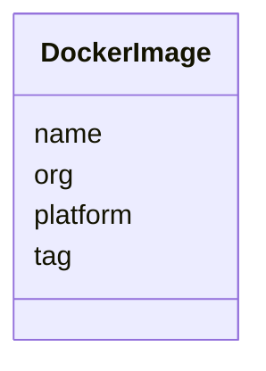

# Class: DockerImage


_Description of docker_image for the specific algorithm_


URI: [https://w3id.org/my-org/validate_schema/:DockerImage](https://w3id.org/my-org/validate_schema/:DockerImage)





<!-- no inheritance hierarchy -->


## Slots

| Name | Cardinality and Range | Description | Inheritance |
| ---  | --- | --- | --- |
| [org](org.md) | 1 <br/> [String](String.md) | Organization of the docker image | direct |
| [name](name.md) | 1 <br/> [String](String.md) | Name of the docker_image, algorithm, parameter, display_only | direct |
| [tag](tag.md) | 1 <br/> [String](String.md) | Tag of the docker image | direct |
| [platform](platform.md) | 1 <br/> [String](String.md) | Platform on which the docker image was built | direct |


## Usages

| used by | used in | type | used |
| ---  | --- | --- | --- |
| [Container](Container.md) | [docker_image](docker_image.md) | range | [DockerImage](DockerImage.md) |


## Aliases


* docker_image


## Identifier and Mapping Information


### Schema Source


* from schema: https://w3id.org/my-org/validate_schema


## Mappings

| Mapping Type | Mapped Value |
| ---  | ---  |
| self | https://w3id.org/my-org/validate_schema/:DockerImage |
| native | https://w3id.org/my-org/validate_schema/:DockerImage |


## LinkML Source

<!-- TODO: investigate https://stackoverflow.com/questions/37606292/how-to-create-tabbed-code-blocks-in-mkdocs-or-sphinx -->

### Direct

<details>
```yaml
name: DockerImage
description: Description of docker_image for the specific algorithm
from_schema: https://w3id.org/my-org/validate_schema
aliases:
- docker_image
slots:
- org
- name
- tag
- platform

```
</details>

### Induced

<details>
```yaml
name: DockerImage
description: Description of docker_image for the specific algorithm
from_schema: https://w3id.org/my-org/validate_schema
aliases:
- docker_image
attributes:
  org:
    name: org
    description: Organization of the docker image
    from_schema: https://w3id.org/my-org/validate_schema
    rank: 1000
    alias: org
    owner: DockerImage
    domain_of:
    - DockerImage
    range: string
    required: true
  name:
    name: name
    description: Name of the docker_image, algorithm, parameter, display_only
    from_schema: https://w3id.org/my-org/validate_schema
    rank: 1000
    alias: name
    owner: DockerImage
    domain_of:
    - AbstractWorkflowDetails
    - AbstractUserInterface
    - ExecFunction
    - DockerImage
    - TypeAlgorithmFromCitation
    range: string
    required: true
  tag:
    name: tag
    description: Tag of the docker image
    from_schema: https://w3id.org/my-org/validate_schema
    rank: 1000
    alias: tag
    owner: DockerImage
    domain_of:
    - DockerImage
    range: string
    required: true
  platform:
    name: platform
    description: Platform on which the docker image was built
    from_schema: https://w3id.org/my-org/validate_schema
    rank: 1000
    alias: platform
    owner: DockerImage
    domain_of:
    - DockerImage
    range: string
    required: true

```
</details>