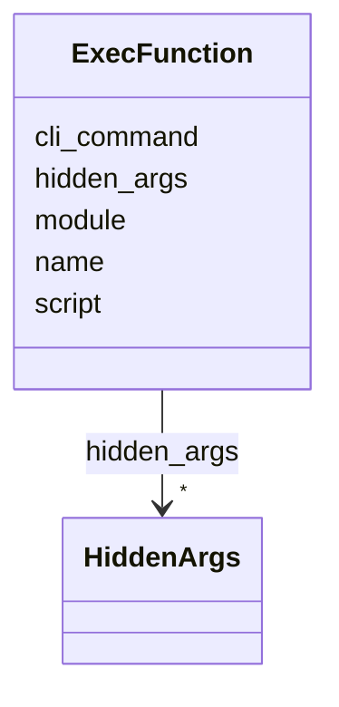

# Class: ExecFunction


_Function to execute the Algorithm_


URI: [https://w3id.org/my-org/bilayers_schema/:ExecFunction](https://w3id.org/my-org/bilayers_schema/:ExecFunction)





<!-- no inheritance hierarchy -->


## Slots

| Name | Cardinality and Range | Description | Inheritance |
| ---  | --- | --- | --- |
| [name](name.md) | 1 <br/> [String](String.md) | Name of the docker_image, algorithm, parameter, display_only | direct |
| [script](script.md) | 1 <br/> [String](String.md) | Script to execute the Algorithm | direct |
| [module](module.md) | 1 <br/> [String](String.md) | Module to execute the Algorithm | direct |
| [cli_command](cli_command.md) | 1 <br/> [String](String.md) | CLI command to execute the Algorithm | direct |
| [hidden_args](hidden_args.md) | * <br/> [HiddenArgs](HiddenArgs.md) | Hidden arguments for the Algorithm | direct |


## Usages

| used by | used in | type | used |
| ---  | --- | --- | --- |
| [SpecContainer](SpecContainer.md) | [exec_function](exec_function.md) | range | [ExecFunction](ExecFunction.md) |


## Aliases


* exec_function
* generate_cli_command
* construct_cli_command


## Identifier and Mapping Information


### Schema Source


* from schema: https://w3id.org/my-org/bilayers_schema


## Mappings

| Mapping Type | Mapped Value |
| ---  | ---  |
| self | https://w3id.org/my-org/bilayers_schema/:ExecFunction |
| native | https://w3id.org/my-org/bilayers_schema/:ExecFunction |


## LinkML Source

<!-- TODO: investigate https://stackoverflow.com/questions/37606292/how-to-create-tabbed-code-blocks-in-mkdocs-or-sphinx -->

### Direct

<details>
```yaml
name: ExecFunction
description: Function to execute the Algorithm
from_schema: https://w3id.org/my-org/bilayers_schema
aliases:
- exec_function
- generate_cli_command
- construct_cli_command
slots:
- name
- script
- module
- cli_command
- hidden_args

```
</details>

### Induced

<details>
```yaml
name: ExecFunction
description: Function to execute the Algorithm
from_schema: https://w3id.org/my-org/bilayers_schema
aliases:
- exec_function
- generate_cli_command
- construct_cli_command
attributes:
  name:
    name: name
    description: Name of the docker_image, algorithm, parameter, display_only
    from_schema: https://w3id.org/my-org/bilayers_schema
    rank: 1000
    alias: name
    owner: ExecFunction
    domain_of:
    - AbstractWorkflowDetails
    - AbstractUserInterface
    - ExecFunction
    - DockerImage
    - TypeAlgorithmFromCitation
    range: string
    required: true
  script:
    name: script
    description: Script to execute the Algorithm
    from_schema: https://w3id.org/my-org/bilayers_schema
    rank: 1000
    alias: script
    owner: ExecFunction
    domain_of:
    - ExecFunction
    range: string
    required: true
  module:
    name: module
    description: Module to execute the Algorithm
    from_schema: https://w3id.org/my-org/bilayers_schema
    rank: 1000
    alias: module
    owner: ExecFunction
    domain_of:
    - ExecFunction
    range: string
    required: true
  cli_command:
    name: cli_command
    description: CLI command to execute the Algorithm
    from_schema: https://w3id.org/my-org/bilayers_schema
    rank: 1000
    alias: cli_command
    owner: ExecFunction
    domain_of:
    - ExecFunction
    range: string
    required: true
  hidden_args:
    name: hidden_args
    description: Hidden arguments for the Algorithm
    from_schema: https://w3id.org/my-org/bilayers_schema
    rank: 1000
    alias: hidden_args
    owner: ExecFunction
    domain_of:
    - ExecFunction
    range: HiddenArgs
    multivalued: true

```
</details>