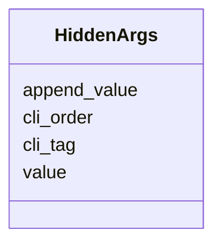

# Class: HiddenArgs


_Hidden arguments for the Algorithm_


URI: [https://w3id.org/my-org/validate_schema/:HiddenArgs](https://w3id.org/my-org/validate_schema/:HiddenArgs)





<!-- no inheritance hierarchy -->


## Slots

| Name | Cardinality and Range | Description | Inheritance |
| ---  | --- | --- | --- |
| [cli_tag](cli_tag.md) | 1 <br/> [String](String.md) |  | direct |
| [value](value.md) | 1 <br/> [String](String.md) |  | direct |
| [append_value](append_value.md) | 0..1 <br/> [Boolean](Boolean.md) |  | direct |
| [cli_order](cli_order.md) | 0..1 <br/> [Integer](Integer.md) |  | direct |


## Usages

| used by | used in | type | used |
| ---  | --- | --- | --- |
| [ExecFunction](ExecFunction.md) | [hidden_args](hidden_args.md) | range | [HiddenArgs](HiddenArgs.md) |


## Identifier and Mapping Information


### Schema Source


* from schema: https://w3id.org/my-org/validate_schema


## Mappings

| Mapping Type | Mapped Value |
| ---  | ---  |
| self | https://w3id.org/my-org/validate_schema/:HiddenArgs |
| native | https://w3id.org/my-org/validate_schema/:HiddenArgs |


## LinkML Source

<!-- TODO: investigate https://stackoverflow.com/questions/37606292/how-to-create-tabbed-code-blocks-in-mkdocs-or-sphinx -->

### Direct

<details>
```yaml
name: HiddenArgs
description: Hidden arguments for the Algorithm
from_schema: https://w3id.org/my-org/validate_schema
attributes:
  cli_tag:
    name: cli_tag
    from_schema: https://w3id.org/my-org/validate_schema
    domain_of:
    - TypeParameter
    - TypeResults
    - HiddenArgs
    range: string
    required: true
  value:
    name: value
    from_schema: https://w3id.org/my-org/validate_schema
    domain_of:
    - HiddenArgs
    - RadioOptions
    range: string
    required: true
  append_value:
    name: append_value
    from_schema: https://w3id.org/my-org/validate_schema
    domain_of:
    - AbstractUserInterface
    - HiddenArgs
    range: boolean
    required: false
  cli_order:
    name: cli_order
    from_schema: https://w3id.org/my-org/validate_schema
    domain_of:
    - TypeParameter
    - HiddenArgs
    range: integer
    required: false

```
</details>

### Induced

<details>
```yaml
name: HiddenArgs
description: Hidden arguments for the Algorithm
from_schema: https://w3id.org/my-org/validate_schema
attributes:
  cli_tag:
    name: cli_tag
    from_schema: https://w3id.org/my-org/validate_schema
    alias: cli_tag
    owner: HiddenArgs
    domain_of:
    - TypeParameter
    - TypeResults
    - HiddenArgs
    range: string
    required: true
  value:
    name: value
    from_schema: https://w3id.org/my-org/validate_schema
    alias: value
    owner: HiddenArgs
    domain_of:
    - HiddenArgs
    - RadioOptions
    range: string
    required: true
  append_value:
    name: append_value
    from_schema: https://w3id.org/my-org/validate_schema
    alias: append_value
    owner: HiddenArgs
    domain_of:
    - AbstractUserInterface
    - HiddenArgs
    range: boolean
    required: false
  cli_order:
    name: cli_order
    from_schema: https://w3id.org/my-org/validate_schema
    alias: cli_order
    owner: HiddenArgs
    domain_of:
    - TypeParameter
    - HiddenArgs
    range: integer
    required: false

```
</details>