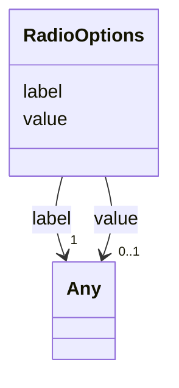

# Class: RadioOptions


_Options of the Radio button in parameters, display_only_


URI: [https://w3id.org/my-org/bilayers_schema/:RadioOptions](https://w3id.org/my-org/bilayers_schema/:RadioOptions)





<!-- no inheritance hierarchy -->


## Slots

| Name | Cardinality and Range | Description | Inheritance |
| ---  | --- | --- | --- |
| [label](label.md) | 1 <br/> [Any](Any.md) | Label of the object, but also Radio button's label | direct |
| [value](value.md) | 0..1 <br/> [Any](Any.md) | Value of the hidden argument or RadioButton Option's Value | direct |


## Usages

| used by | used in | type | used |
| ---  | --- | --- | --- |
| [AbstractUserInterface](AbstractUserInterface.md) | [options](options.md) | range | [RadioOptions](RadioOptions.md) |
| [TypeParameter](TypeParameter.md) | [options](options.md) | range | [RadioOptions](RadioOptions.md) |
| [TypeDisplayOnly](TypeDisplayOnly.md) | [options](options.md) | range | [RadioOptions](RadioOptions.md) |


## Identifier and Mapping Information


### Schema Source


* from schema: https://w3id.org/my-org/bilayers_schema


## Mappings

| Mapping Type | Mapped Value |
| ---  | ---  |
| self | https://w3id.org/my-org/bilayers_schema/:RadioOptions |
| native | https://w3id.org/my-org/bilayers_schema/:RadioOptions |


## LinkML Source

<!-- TODO: investigate https://stackoverflow.com/questions/37606292/how-to-create-tabbed-code-blocks-in-mkdocs-or-sphinx -->

### Direct

<details>
```yaml
name: RadioOptions
description: Options of the Radio button in parameters, display_only
from_schema: https://w3id.org/my-org/bilayers_schema
slots:
- label
- value

```
</details>

### Induced

<details>
```yaml
name: RadioOptions
description: Options of the Radio button in parameters, display_only
from_schema: https://w3id.org/my-org/bilayers_schema
attributes:
  label:
    name: label
    description: Label of the object, but also Radio button's label
    from_schema: https://w3id.org/my-org/bilayers_schema
    rank: 1000
    alias: label
    owner: RadioOptions
    domain_of:
    - AbstractWorkflowDetails
    - AbstractUserInterface
    - RadioOptions
    range: Any
    required: true
  value:
    name: value
    description: Value of the hidden argument or RadioButton Option's Value
    from_schema: https://w3id.org/my-org/bilayers_schema
    rank: 1000
    alias: value
    owner: RadioOptions
    domain_of:
    - HiddenArgs
    - RadioOptions
    range: Any

```
</details>