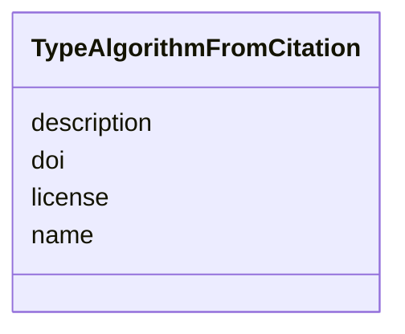

# Class: TypeAlgorithmFromCitation


_Algorithm's citations_


URI: [https://w3id.org/my-org/validate_schema/:TypeAlgorithmFromCitation](https://w3id.org/my-org/validate_schema/:TypeAlgorithmFromCitation)





<!-- no inheritance hierarchy -->


## Slots

| Name | Cardinality and Range | Description | Inheritance |
| ---  | --- | --- | --- |
| [name](name.md) | 1 <br/> [String](String.md) | Name of the docker_image, algorithm, parameter, display_only | direct |
| [doi](doi.md) | 0..1 <br/> [String](String.md) | DOI of the Algorithm | direct |
| [license](license.md) | 0..1 <br/> [String](String.md) | License of the Algorithm | direct |
| [description](description.md) | 0..1 <br/> [String](String.md) | Description of the Algorithm | direct |


## Usages

| used by | used in | type | used |
| ---  | --- | --- | --- |
| [TypeCitations](TypeCitations.md) | [algorithm](algorithm.md) | range | [TypeAlgorithmFromCitation](TypeAlgorithmFromCitation.md) |


## Aliases


* Algorithm
* citations


## Identifier and Mapping Information


### Schema Source


* from schema: https://w3id.org/my-org/validate_schema


## Mappings

| Mapping Type | Mapped Value |
| ---  | ---  |
| self | https://w3id.org/my-org/validate_schema/:TypeAlgorithmFromCitation |
| native | https://w3id.org/my-org/validate_schema/:TypeAlgorithmFromCitation |


## LinkML Source

<!-- TODO: investigate https://stackoverflow.com/questions/37606292/how-to-create-tabbed-code-blocks-in-mkdocs-or-sphinx -->

### Direct

<details>
```yaml
name: TypeAlgorithmFromCitation
description: Algorithm's citations
from_schema: https://w3id.org/my-org/validate_schema
aliases:
- Algorithm
- citations
slots:
- name
- doi
- license
- description

```
</details>

### Induced

<details>
```yaml
name: TypeAlgorithmFromCitation
description: Algorithm's citations
from_schema: https://w3id.org/my-org/validate_schema
aliases:
- Algorithm
- citations
attributes:
  name:
    name: name
    description: Name of the docker_image, algorithm, parameter, display_only
    from_schema: https://w3id.org/my-org/validate_schema
    rank: 1000
    alias: name
    owner: TypeAlgorithmFromCitation
    domain_of:
    - AbstractWorkflowDetails
    - AbstractUserInterface
    - ExecFunction
    - DockerImage
    - TypeAlgorithmFromCitation
    range: string
    required: true
  doi:
    name: doi
    description: DOI of the Algorithm
    from_schema: https://w3id.org/my-org/validate_schema
    rank: 1000
    alias: doi
    owner: TypeAlgorithmFromCitation
    domain_of:
    - TypeAlgorithmFromCitation
    range: string
  license:
    name: license
    description: License of the Algorithm
    from_schema: https://w3id.org/my-org/validate_schema
    rank: 1000
    alias: license
    owner: TypeAlgorithmFromCitation
    domain_of:
    - TypeAlgorithmFromCitation
    range: string
  description:
    name: description
    description: Description of the Algorithm
    from_schema: https://w3id.org/my-org/validate_schema
    rank: 1000
    alias: description
    owner: TypeAlgorithmFromCitation
    domain_of:
    - AbstractWorkflowDetails
    - AbstractUserInterface
    - TypeAlgorithmFromCitation
    range: string

```
</details>