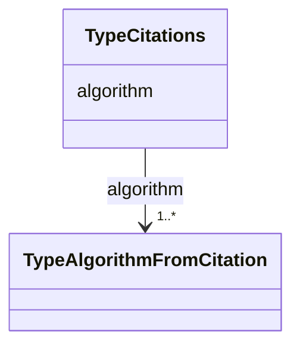

# Class: TypeCitations


_Citations of the Algorithm_


URI: [https://w3id.org/my-org/validate_schema/:TypeCitations](https://w3id.org/my-org/validate_schema/:TypeCitations)





<!-- no inheritance hierarchy -->


## Slots

| Name | Cardinality and Range | Description | Inheritance |
| ---  | --- | --- | --- |
| [algorithm](algorithm.md) | 1..* <br/> [TypeAlgorithmFromCitation](TypeAlgorithmFromCitation.md) | Algorithm's citations | direct |


## Usages

| used by | used in | type | used |
| ---  | --- | --- | --- |
| [Container](Container.md) | [citations](citations.md) | range | [TypeCitations](TypeCitations.md) |


## Aliases


* citations


## Identifier and Mapping Information


### Schema Source


* from schema: https://w3id.org/my-org/validate_schema


## Mappings

| Mapping Type | Mapped Value |
| ---  | ---  |
| self | https://w3id.org/my-org/validate_schema/:TypeCitations |
| native | https://w3id.org/my-org/validate_schema/:TypeCitations |


## LinkML Source

<!-- TODO: investigate https://stackoverflow.com/questions/37606292/how-to-create-tabbed-code-blocks-in-mkdocs-or-sphinx -->

### Direct

<details>
```yaml
name: TypeCitations
description: Citations of the Algorithm
from_schema: https://w3id.org/my-org/validate_schema
aliases:
- citations
slots:
- algorithm

```
</details>

### Induced

<details>
```yaml
name: TypeCitations
description: Citations of the Algorithm
from_schema: https://w3id.org/my-org/validate_schema
aliases:
- citations
attributes:
  algorithm:
    name: algorithm
    description: Algorithm's citations
    from_schema: https://w3id.org/my-org/validate_schema
    rank: 1000
    alias: algorithm
    owner: TypeCitations
    domain_of:
    - TypeCitations
    range: TypeAlgorithmFromCitation
    required: true
    multivalued: true

```
</details>