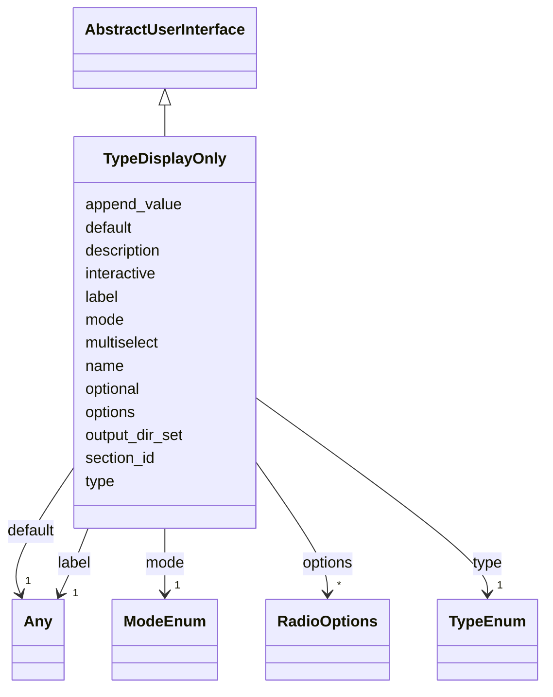

# Class: TypeDisplayOnly


_Display only parameters of a specific Algorithm_


URI: [https://w3id.org/my-org/bilayers_schema/:TypeDisplayOnly](https://w3id.org/my-org/bilayers_schema/:TypeDisplayOnly)





## Inheritance
* [AbstractUserInterface](AbstractUserInterface.md)
    * **TypeDisplayOnly**


## Slots

| Name | Cardinality and Range | Description | Inheritance |
| ---  | --- | --- | --- |
| [default](default.md) | 1 <br/> [Any](Any.md) | Default value of the parameter | direct |
| [name](name.md) | 1 <br/> [String](String.md) | Name of the docker_image, algorithm, parameter, display_only | [AbstractUserInterface](AbstractUserInterface.md) |
| [type](type.md) | 1 <br/> [TypeEnum](TypeEnum.md) | Type of the inputs, parameters and outputs | [AbstractUserInterface](AbstractUserInterface.md) |
| [label](label.md) | 1 <br/> [Any](Any.md) | Label of the object, but also Radio button's label | [AbstractUserInterface](AbstractUserInterface.md) |
| [description](description.md) | 0..1 <br/> [String](String.md) | Description of the Algorithm | [AbstractUserInterface](AbstractUserInterface.md) |
| [optional](optional.md) | 1 <br/> [Boolean](Boolean.md) | Optional value of the object | [AbstractUserInterface](AbstractUserInterface.md) |
| [section_id](section_id.md) | 1 <br/> [String](String.md) | Section ID of the object | [AbstractUserInterface](AbstractUserInterface.md) |
| [mode](mode.md) | 1 <br/> [ModeEnum](ModeEnum.md) | Mode of the object | [AbstractUserInterface](AbstractUserInterface.md) |
| [output_dir_set](output_dir_set.md) | 0..1 <br/> [Boolean](Boolean.md) | Output directory set | [AbstractUserInterface](AbstractUserInterface.md) |
| [options](options.md) | * <br/> [RadioOptions](RadioOptions.md) | Options of the Radio button in parameters, display_only | [AbstractUserInterface](AbstractUserInterface.md) |
| [interactive](interactive.md) | 0..1 <br/> [Boolean](Boolean.md) | Whether the object is interactive on UI | [AbstractUserInterface](AbstractUserInterface.md) |
| [append_value](append_value.md) | 0..1 <br/> [Boolean](Boolean.md) | Append value of the hidden argument | [AbstractUserInterface](AbstractUserInterface.md) |
| [multiselect](multiselect.md) | 0..1 <br/> [Boolean](Boolean.md) | Multiselect value of the dropdown | [AbstractUserInterface](AbstractUserInterface.md) |


## Usages

| used by | used in | type | used |
| ---  | --- | --- | --- |
| [SpecContainer](SpecContainer.md) | [display_only](display_only.md) | range | [TypeDisplayOnly](TypeDisplayOnly.md) |


## Aliases


* display_only


## Identifier and Mapping Information


### Schema Source


* from schema: https://w3id.org/my-org/bilayers_schema


## Mappings

| Mapping Type | Mapped Value |
| ---  | ---  |
| self | https://w3id.org/my-org/bilayers_schema/:TypeDisplayOnly |
| native | https://w3id.org/my-org/bilayers_schema/:TypeDisplayOnly |


## LinkML Source

<!-- TODO: investigate https://stackoverflow.com/questions/37606292/how-to-create-tabbed-code-blocks-in-mkdocs-or-sphinx -->

### Direct

<details>
```yaml
name: TypeDisplayOnly
description: Display only parameters of a specific Algorithm
from_schema: https://w3id.org/my-org/bilayers_schema
aliases:
- display_only
is_a: AbstractUserInterface
slots:
- default

```
</details>

### Induced

<details>
```yaml
name: TypeDisplayOnly
description: Display only parameters of a specific Algorithm
from_schema: https://w3id.org/my-org/bilayers_schema
aliases:
- display_only
is_a: AbstractUserInterface
attributes:
  default:
    name: default
    description: Default value of the parameter
    from_schema: https://w3id.org/my-org/bilayers_schema
    rank: 1000
    alias: default
    owner: TypeDisplayOnly
    domain_of:
    - AbstractWorkflowDetails
    - TypeParameter
    - TypeDisplayOnly
    range: Any
    required: true
  name:
    name: name
    description: Name of the docker_image, algorithm, parameter, display_only
    from_schema: https://w3id.org/my-org/bilayers_schema
    rank: 1000
    alias: name
    owner: TypeDisplayOnly
    domain_of:
    - AbstractWorkflowDetails
    - AbstractUserInterface
    - ExecFunction
    - DockerImage
    - TypeCitations
    range: string
    required: true
  type:
    name: type
    description: Type of the inputs, parameters and outputs
    from_schema: https://w3id.org/my-org/bilayers_schema
    rank: 1000
    alias: type
    owner: TypeDisplayOnly
    domain_of:
    - AbstractWorkflowDetails
    - AbstractUserInterface
    range: TypeEnum
    required: true
  label:
    name: label
    description: Label of the object, but also Radio button's label
    from_schema: https://w3id.org/my-org/bilayers_schema
    rank: 1000
    alias: label
    owner: TypeDisplayOnly
    domain_of:
    - AbstractWorkflowDetails
    - AbstractUserInterface
    - RadioOptions
    range: Any
    required: true
  description:
    name: description
    description: Description of the Algorithm
    from_schema: https://w3id.org/my-org/bilayers_schema
    rank: 1000
    alias: description
    owner: TypeDisplayOnly
    domain_of:
    - AbstractWorkflowDetails
    - AbstractUserInterface
    - TypeCitations
    range: string
  optional:
    name: optional
    description: Optional value of the object
    from_schema: https://w3id.org/my-org/bilayers_schema
    rank: 1000
    alias: optional
    owner: TypeDisplayOnly
    domain_of:
    - AbstractWorkflowDetails
    - AbstractUserInterface
    range: boolean
    required: true
  section_id:
    name: section_id
    description: Section ID of the object
    from_schema: https://w3id.org/my-org/bilayers_schema
    rank: 1000
    alias: section_id
    owner: TypeDisplayOnly
    domain_of:
    - AbstractWorkflowDetails
    - AbstractUserInterface
    range: string
    required: true
  mode:
    name: mode
    description: Mode of the object
    from_schema: https://w3id.org/my-org/bilayers_schema
    rank: 1000
    alias: mode
    owner: TypeDisplayOnly
    domain_of:
    - AbstractWorkflowDetails
    - AbstractUserInterface
    range: ModeEnum
    required: true
  output_dir_set:
    name: output_dir_set
    description: Output directory set
    from_schema: https://w3id.org/my-org/bilayers_schema
    rank: 1000
    alias: output_dir_set
    owner: TypeDisplayOnly
    domain_of:
    - AbstractUserInterface
    range: boolean
    required: false
  options:
    name: options
    description: Options of the Radio button in parameters, display_only
    from_schema: https://w3id.org/my-org/bilayers_schema
    rank: 1000
    alias: options
    owner: TypeDisplayOnly
    domain_of:
    - AbstractUserInterface
    range: RadioOptions
    required: false
    multivalued: true
  interactive:
    name: interactive
    description: Whether the object is interactive on UI
    from_schema: https://w3id.org/my-org/bilayers_schema
    rank: 1000
    alias: interactive
    owner: TypeDisplayOnly
    domain_of:
    - AbstractUserInterface
    range: boolean
    required: false
  append_value:
    name: append_value
    description: Append value of the hidden argument
    from_schema: https://w3id.org/my-org/bilayers_schema
    rank: 1000
    alias: append_value
    owner: TypeDisplayOnly
    domain_of:
    - AbstractUserInterface
    - HiddenArgs
    range: boolean
    required: false
  multiselect:
    name: multiselect
    description: Multiselect value of the dropdown
    from_schema: https://w3id.org/my-org/bilayers_schema
    rank: 1000
    alias: multiselect
    owner: TypeDisplayOnly
    domain_of:
    - AbstractUserInterface
    range: boolean
    required: false

```
</details>