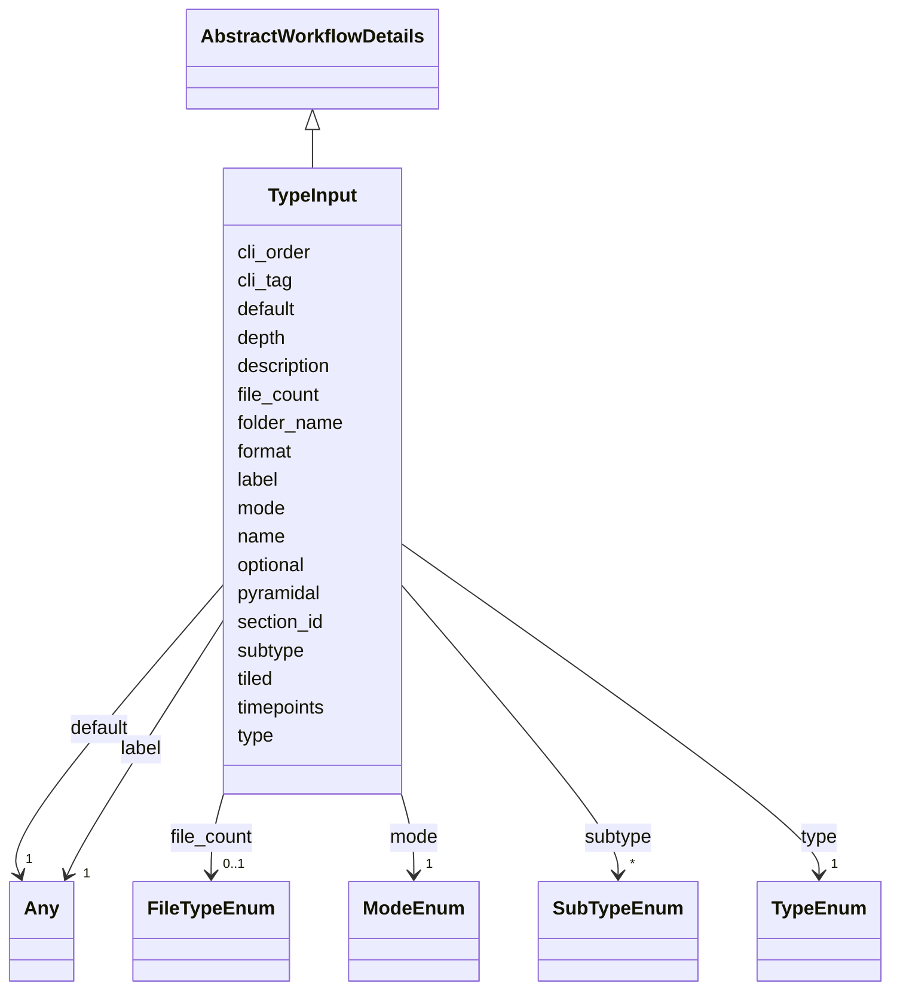

# Class: TypeInput


_Inputs to the algorithm from the last step of the workflow_


URI: [https://w3id.org/my-org/validate_schema/:TypeInput](https://w3id.org/my-org/validate_schema/:TypeInput)





## Inheritance
* [AbstractWorkflowDetails](AbstractWorkflowDetails.md)
    * **TypeInput**


## Slots

| Name | Cardinality and Range | Description | Inheritance |
| ---  | --- | --- | --- |
| [name](name.md) | 1 <br/> [String](String.md) | Name of the docker_image, algorithm, parameter, display_only | [AbstractWorkflowDetails](AbstractWorkflowDetails.md) |
| [type](type.md) | 1 <br/> [TypeEnum](TypeEnum.md) | Type of the inputs, parameters and outputs | [AbstractWorkflowDetails](AbstractWorkflowDetails.md) |
| [label](label.md) | 1 <br/> [Any](Any.md) | Label of the object, but also Radio button's label | [AbstractWorkflowDetails](AbstractWorkflowDetails.md) |
| [description](description.md) | 0..1 <br/> [String](String.md) | Description of the Algorithm | [AbstractWorkflowDetails](AbstractWorkflowDetails.md) |
| [cli_tag](cli_tag.md) | 1 <br/> [String](String.md) | CLI tag of the object | [AbstractWorkflowDetails](AbstractWorkflowDetails.md) |
| [cli_order](cli_order.md) | 0..1 <br/> [Integer](Integer.md) | Order of the CLI arguments | [AbstractWorkflowDetails](AbstractWorkflowDetails.md) |
| [default](default.md) | 1 <br/> [Any](Any.md) | Default value of the parameter | [AbstractWorkflowDetails](AbstractWorkflowDetails.md) |
| [optional](optional.md) | 1 <br/> [Boolean](Boolean.md) | Optional value of the object | [AbstractWorkflowDetails](AbstractWorkflowDetails.md) |
| [format](format.md) | * <br/> [String](String.md) | Format of the inputs and outputs | [AbstractWorkflowDetails](AbstractWorkflowDetails.md) |
| [folder_name](folder_name.md) | 0..1 <br/> [String](String.md) | Folder name of the object | [AbstractWorkflowDetails](AbstractWorkflowDetails.md) |
| [file_count](file_count.md) | 0..1 <br/> [FileTypeEnum](FileTypeEnum.md) | Type of Number of files | [AbstractWorkflowDetails](AbstractWorkflowDetails.md) |
| [section_id](section_id.md) | 1 <br/> [String](String.md) | Section ID of the object | [AbstractWorkflowDetails](AbstractWorkflowDetails.md) |
| [mode](mode.md) | 1 <br/> [ModeEnum](ModeEnum.md) | Mode of the object | [AbstractWorkflowDetails](AbstractWorkflowDetails.md) |
| [subtype](subtype.md) | * <br/> [SubTypeEnum](SubTypeEnum.md) | Subtype of the inputs and outputs | [AbstractWorkflowDetails](AbstractWorkflowDetails.md) |
| [depth](depth.md) | 0..1 <br/> [Boolean](Boolean.md) | whether z-dimension i | [AbstractWorkflowDetails](AbstractWorkflowDetails.md) |
| [timepoints](timepoints.md) | 0..1 <br/> [Boolean](Boolean.md) | whether t-dimension i | [AbstractWorkflowDetails](AbstractWorkflowDetails.md) |
| [tiled](tiled.md) | 0..1 <br/> [Boolean](Boolean.md) | whether tiled images are accepted via tool | [AbstractWorkflowDetails](AbstractWorkflowDetails.md) |
| [pyramidal](pyramidal.md) | 0..1 <br/> [Boolean](Boolean.md) | whether pyramidal images are accepted via tool | [AbstractWorkflowDetails](AbstractWorkflowDetails.md) |


## Usages

| used by | used in | type | used |
| ---  | --- | --- | --- |
| [Container](Container.md) | [inputs](inputs.md) | range | [TypeInput](TypeInput.md) |


## Aliases


* inputs


## Identifier and Mapping Information


### Schema Source


* from schema: https://w3id.org/my-org/validate_schema


## Mappings

| Mapping Type | Mapped Value |
| ---  | ---  |
| self | https://w3id.org/my-org/validate_schema/:TypeInput |
| native | https://w3id.org/my-org/validate_schema/:TypeInput |


## LinkML Source

<!-- TODO: investigate https://stackoverflow.com/questions/37606292/how-to-create-tabbed-code-blocks-in-mkdocs-or-sphinx -->

### Direct

<details>
```yaml
name: TypeInput
description: Inputs to the algorithm from the last step of the workflow
from_schema: https://w3id.org/my-org/validate_schema
aliases:
- inputs
is_a: AbstractWorkflowDetails
rules:
- preconditions:
    slot_conditions:
      type:
        name: type
        equals_string: image
  postconditions:
    slot_conditions:
      subtype:
        name: subtype
        required: true
      depth:
        name: depth
        required: true
      timepoints:
        name: timepoints
        required: true
      tiled:
        name: tiled
        required: true
      pyramidal:
        name: pyramidal
        required: true
  description: Extra flags needed iff type is image

```
</details>

### Induced

<details>
```yaml
name: TypeInput
description: Inputs to the algorithm from the last step of the workflow
from_schema: https://w3id.org/my-org/validate_schema
aliases:
- inputs
is_a: AbstractWorkflowDetails
attributes:
  name:
    name: name
    description: Name of the docker_image, algorithm, parameter, display_only
    from_schema: https://w3id.org/my-org/validate_schema
    rank: 1000
    alias: name
    owner: TypeInput
    domain_of:
    - AbstractWorkflowDetails
    - AbstractUserInterface
    - ExecFunction
    - DockerImage
    - TypeAlgorithmFromCitation
    range: string
    required: true
  type:
    name: type
    description: Type of the inputs, parameters and outputs
    from_schema: https://w3id.org/my-org/validate_schema
    rank: 1000
    alias: type
    owner: TypeInput
    domain_of:
    - AbstractWorkflowDetails
    - AbstractUserInterface
    range: TypeEnum
    required: true
  label:
    name: label
    description: Label of the object, but also Radio button's label
    from_schema: https://w3id.org/my-org/validate_schema
    rank: 1000
    alias: label
    owner: TypeInput
    domain_of:
    - AbstractWorkflowDetails
    - AbstractUserInterface
    - RadioOptions
    range: Any
    required: true
  description:
    name: description
    description: Description of the Algorithm
    from_schema: https://w3id.org/my-org/validate_schema
    rank: 1000
    alias: description
    owner: TypeInput
    domain_of:
    - AbstractWorkflowDetails
    - AbstractUserInterface
    - TypeAlgorithmFromCitation
    range: string
  cli_tag:
    name: cli_tag
    description: CLI tag of the object
    from_schema: https://w3id.org/my-org/validate_schema
    rank: 1000
    alias: cli_tag
    owner: TypeInput
    domain_of:
    - AbstractWorkflowDetails
    - TypeParameter
    - HiddenArgs
    range: string
    required: true
  cli_order:
    name: cli_order
    description: Order of the CLI arguments
    from_schema: https://w3id.org/my-org/validate_schema
    rank: 1000
    alias: cli_order
    owner: TypeInput
    domain_of:
    - AbstractWorkflowDetails
    - TypeParameter
    - HiddenArgs
    range: integer
    required: false
  default:
    name: default
    description: Default value of the parameter
    from_schema: https://w3id.org/my-org/validate_schema
    rank: 1000
    alias: default
    owner: TypeInput
    domain_of:
    - AbstractWorkflowDetails
    - TypeParameter
    - TypeDisplayOnly
    range: Any
    required: true
  optional:
    name: optional
    description: Optional value of the object
    from_schema: https://w3id.org/my-org/validate_schema
    rank: 1000
    alias: optional
    owner: TypeInput
    domain_of:
    - AbstractWorkflowDetails
    - AbstractUserInterface
    range: boolean
    required: true
  format:
    name: format
    description: Format of the inputs and outputs
    from_schema: https://w3id.org/my-org/validate_schema
    rank: 1000
    alias: format
    owner: TypeInput
    domain_of:
    - AbstractWorkflowDetails
    range: string
    multivalued: true
  folder_name:
    name: folder_name
    description: Folder name of the object
    from_schema: https://w3id.org/my-org/validate_schema
    rank: 1000
    alias: folder_name
    owner: TypeInput
    domain_of:
    - AbstractWorkflowDetails
    - AbstractUserInterface
    range: string
    required: false
  file_count:
    name: file_count
    description: Type of Number of files
    from_schema: https://w3id.org/my-org/validate_schema
    rank: 1000
    alias: file_count
    owner: TypeInput
    domain_of:
    - AbstractWorkflowDetails
    - AbstractUserInterface
    range: FileTypeEnum
    required: false
  section_id:
    name: section_id
    description: Section ID of the object
    from_schema: https://w3id.org/my-org/validate_schema
    rank: 1000
    alias: section_id
    owner: TypeInput
    domain_of:
    - AbstractWorkflowDetails
    - AbstractUserInterface
    range: string
    required: true
  mode:
    name: mode
    description: Mode of the object
    from_schema: https://w3id.org/my-org/validate_schema
    rank: 1000
    alias: mode
    owner: TypeInput
    domain_of:
    - AbstractWorkflowDetails
    - AbstractUserInterface
    range: ModeEnum
    required: true
  subtype:
    name: subtype
    description: Subtype of the inputs and outputs
    from_schema: https://w3id.org/my-org/validate_schema
    rank: 1000
    alias: subtype
    owner: TypeInput
    domain_of:
    - AbstractWorkflowDetails
    range: SubTypeEnum
    multivalued: true
  depth:
    name: depth
    description: whether z-dimension i.e. depth is accepted via tool
    from_schema: https://w3id.org/my-org/validate_schema
    rank: 1000
    alias: depth
    owner: TypeInput
    domain_of:
    - AbstractWorkflowDetails
    range: boolean
  timepoints:
    name: timepoints
    description: whether t-dimension i.e. timepoints are accepted via tool
    from_schema: https://w3id.org/my-org/validate_schema
    rank: 1000
    alias: timepoints
    owner: TypeInput
    domain_of:
    - AbstractWorkflowDetails
    range: boolean
  tiled:
    name: tiled
    description: whether tiled images are accepted via tool
    from_schema: https://w3id.org/my-org/validate_schema
    rank: 1000
    alias: tiled
    owner: TypeInput
    domain_of:
    - AbstractWorkflowDetails
    range: boolean
  pyramidal:
    name: pyramidal
    description: whether pyramidal images are accepted via tool
    from_schema: https://w3id.org/my-org/validate_schema
    rank: 1000
    alias: pyramidal
    owner: TypeInput
    domain_of:
    - AbstractWorkflowDetails
    range: boolean
rules:
- preconditions:
    slot_conditions:
      type:
        name: type
        equals_string: image
  postconditions:
    slot_conditions:
      subtype:
        name: subtype
        required: true
      depth:
        name: depth
        required: true
      timepoints:
        name: timepoints
        required: true
      tiled:
        name: tiled
        required: true
      pyramidal:
        name: pyramidal
        required: true
  description: Extra flags needed iff type is image

```
</details>