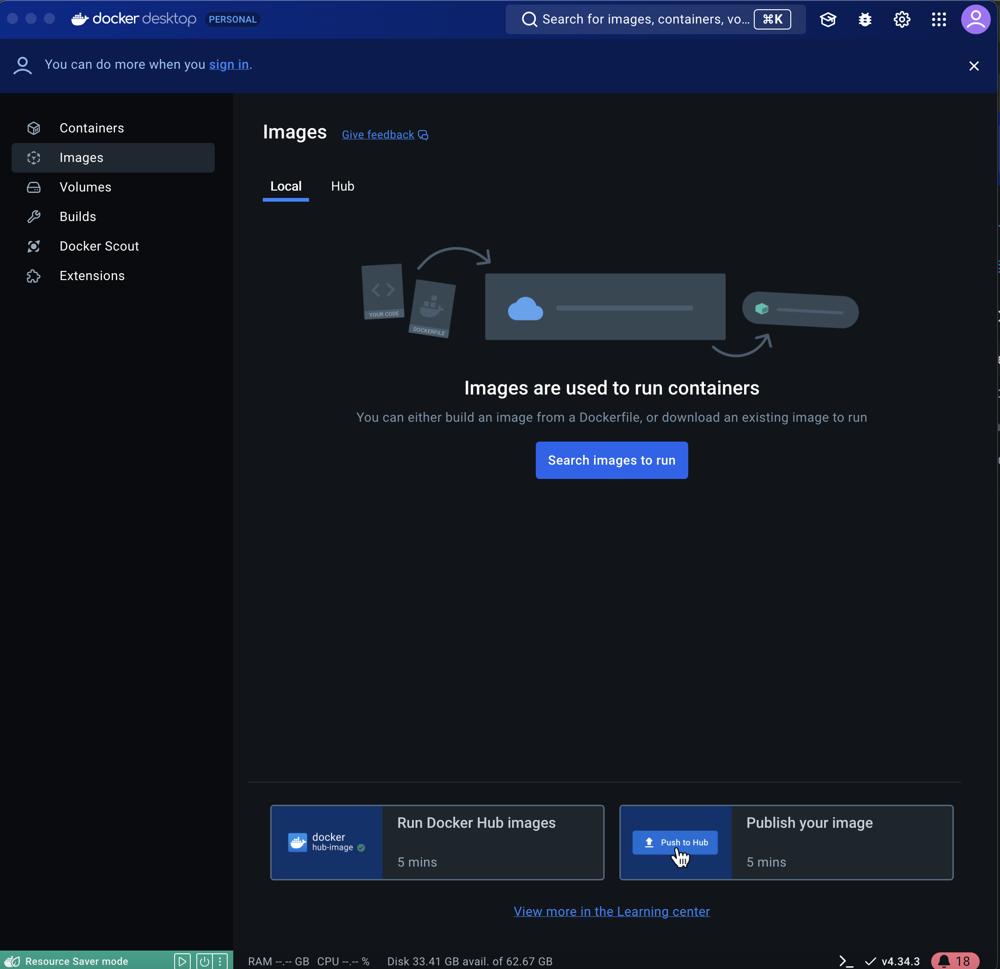

Bilayers provides Docker Images for some of the widely accepted bioimage analysis algorithms, complete with web or Jupyter Notebook interfaces, available on DockerHub. If you're new to Docker and want a quick overview, check out [this introductory blog post on Docker](https://carpenter-singh-lab.broadinstitute.org/docker_for_biologists) to get started.

## Prerequisites

1. Install Docker Desktop
    - For Mac: [Docker Desktop for Mac](https://docs.docker.com/desktop/install/mac-install/)
    - For Windows: [Docker Desktop for Windows](https://docs.docker.com/desktop/install/windows-install/)

2. DockerHub Account
    Log in with your DockerHub credentials
    

